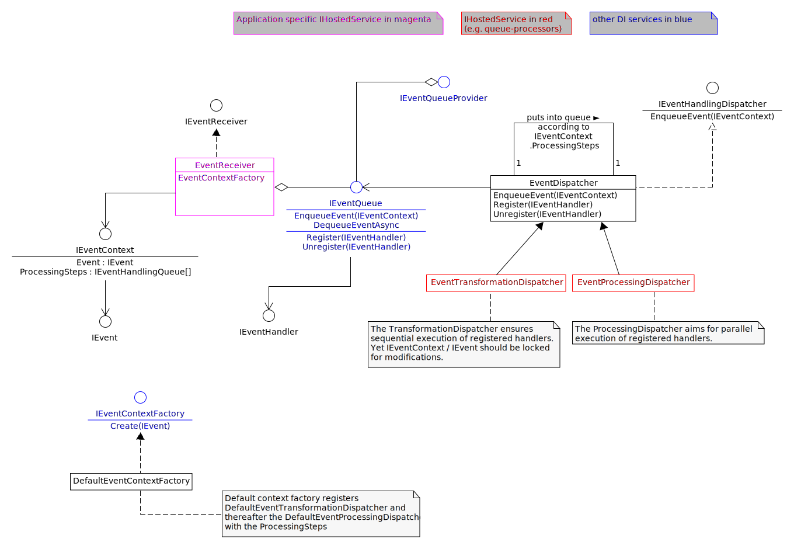

# SRF.Industrial.Events

## Purpose

A framework foreseen to receive, transform and handle events from (physical) systems, received through arbitrary connections or in the app internally generated.
Events can be routed across an arbitrary sequence of processing queues. The predefined default is first a transformation and thereafter processing (the actual handling) via another queue.

Originally created to handle events in a home automation context, it can as well serve the handling of factory machine log and status transition events.

It's not supposed to be a typical event bus connecting services in a microservice architecture. But it could serve as an in-app adapter to such an event bus.

## Function principle

### Overview of key types



### Base structure

Application specific implementations of `EventReceiver : IEventReceiver` and `IEventContextFactory<TEvent>` would serve the creation of `IEvent` objects encapsulated in a metadata container `IEventContext<TEvent>`. The receiver must, after creation of the context, pass the `IEventContext` object to
it's first queue. Once all handlers of a queue are processed, the `IEventHandlingDispatcher` processing the queue items hands the event context
onwards to the next queue as per the list in the context object.

The framework uses dedicated queues, keyed singletons in DI, and background workers `BackgroundService` to execute the registered event handlers.
While the `EventTransformationDispatcher` ensures sequential execution of the registered handlers, the subsequent `EventProcessingDispatcher` calls
all registered event handlers at once via the thread pool.

If `IServiceCollection AddBasicEventsProcessing<TEvent>(this IServiceCollection services) where TEvent : class, IEvent` from the namespace
`SRF.Industrial.Events.Abstractions` is used to register all related services, the transformation and processing queues are available as DI services:

- `IServiceProvider.GetRequiredKeyedService<IEventQueue>("EventTransformation")`

- `IServiceProvider.GetRequiredKeyedService<IEventQueue>("EventProcessing")`

### Application specific

Instanciate as many `IEventReceiver`s as required, preferably by inheriting from the abstract class `EventReceiver`.
Ensure their registration as hosted services via `services.AddHostedService<..>()`.

Provide one or more custom `IEvent` per receiver and one signle corresponding `IEventContext<TEvent>` implementation per receiver.
For simple scenarios the implementation of the `IEvent` might be sufficient, covering `IEventContext<TEvent>` with the generic implementation
provided by the library: `EventContext<TEvent>`

## Usage sample code

### Basic scenario

Might still be available: [SRF.Industrial.Events.Sample, Version 0.1.0](https://sfuchs.ch/div/SRF.Industrial.Events.Sample.v0.1.0.tar.gz)
Entry method of the sample program:

```csharp
namespace SRF.Industrial.Events.Sample;

using Microsoft.Extensions.DependencyInjection;
using Microsoft.Extensions.Hosting;
using Microsoft.Extensions.Logging;
using SRF.Industrial.Events.Abstractions;
using SRF.Industrial.Events.Extensions;

public class Program
{
    public static void Main(string[] args)
    {
        // Build the service host
        var builder = Host.CreateApplicationBuilder(args);
        builder.Logging.AddSimpleConsole();

        // Add event processing services
        // If you have different Event types, either configure all services directly here,
        // or create separate service collections for each event type and merge them into the main service collection
        builder.Services.AddBasicEventsProcessing<SampleEvent>();
        builder.Services.AddHostedService<SampleEventReceiver>();

        var app = builder.Build();

        // Register event handlers. Could be done from another DI service as well and at any time once services are available.
        var queueProvider = app.Services.GetRequiredService<IEventQueueProvider>();
        queueProvider.GetQueue("EventTransformation").Register(
            new SampleTransformationHandler(
                app.Services.GetRequiredService<Microsoft.Extensions.Logging.ILogger<EventHandlerBase<IEventContext<SampleEvent>>>>()
            ));
        queueProvider.GetQueue("EventProcessing").Register(
            new SampleProcessingHandler(
                app.Services.GetRequiredService<Microsoft.Extensions.Logging.ILogger<EventHandlerBase<IEventContext<SampleEvent>>>>()
            ));

        app.Run();
    }
}
```

### Complex scenarios

Set up customized services, e.g. by modifying the services configuration of the basic scenario (code from version 0.1.0).

```csharp
public static IServiceCollection AddBasicEventsProcessing<TEvent>(this IServiceCollection services) where TEvent : class, IEvent
{
    var transformQueueKey = "EventTransformation";
    var processingQueueKey = "EventProcessing";

    services.AddSingleton<IEventQueueProvider,EventQueueProvider>(
        (s) => new EventQueueProvider(
            s,
            [transformQueueKey, processingQueueKey],
            s.GetRequiredService<ILogger<EventQueueProvider>>()
        ));
        
    services.AddSingleton<IEventContextFactory<TEvent>, EventContextFactory<TEvent>>();
    services.AddSingleton<IEventContextFactory>(s => s.GetRequiredService<IEventContextFactory<TEvent>>());

    services.AddKeyedSingleton<IEventQueue, EventQueue>(transformQueueKey, (s, o) => new EventQueue(o as string ?? throw new ArgumentNullException(nameof(o)), s.GetRequiredService<ILogger<EventQueue>>()));
    services.AddKeyedSingleton<IEventQueue, EventQueue>(processingQueueKey, (s, o) => new EventQueue(o as string ?? throw new ArgumentNullException(nameof(o)), s.GetRequiredService<ILogger<EventQueue>>()));

    services.AddHostedService(
        (s) => new EventTransformationDispatcher(
            s.GetRequiredKeyedService<IEventQueue>(transformQueueKey),
            s.GetRequiredService<ILogger<EventTransformationDispatcher>>(),
            s.GetRequiredService<ILogger<EventDispatcher>>()
        )
    ); 
    services.AddHostedService(
        (s) => new EventProcessingDispatcher(
            s.GetRequiredKeyedService<IEventQueue>(processingQueueKey),
            s.GetRequiredService<ILogger<EventProcessingDispatcher>>(),
            s.GetRequiredService<ILogger<EventDispatcher>>()
        )
    );

    return services;
}
```
